# Database Entity Relationship Diagram (ERD)

## ERD Diagram (Mermaid Format)

```mermaid
erDiagram
    User ||--o{ Producer : "has profile"
    User ||--o{ Buyer : "has profile"
    Producer ||--o{ ProductLot : creates
    ProductLot }o--|| Category : belongs_to
    Buyer ||--o{ QuoteRequest : creates
    QuoteRequest }o--|| ProductLot : "requests quote for"
    QuoteRequest ||--o{ QuoteResponse : "receives responses"
    QuoteResponse }o--|| Producer : "submitted by"
    QuoteResponse ||--o{ Order : "leads to"
    Order }o--|| Buyer : "placed by"
    Order }o--|| Producer : "fulfilled by"
    Order }o--|| ProductLot : "contains"
    Order ||--o{ EscrowAccount : "has escrow"
    Order ||--o{ PaymentTransaction : "has payments"
    User ||--o{ KycDocument : "uploads"
    User ||--o{ Address : "has addresses"

    User {
        bigint user_id PK
        varchar email UK
        varchar phone UK
        varchar password_hash
        enum role
        enum status
        timestamp email_verified_at
        timestamp phone_verified_at
        timestamp created_at
        timestamp updated_at
    }

    Producer {
        bigint producer_id PK
        bigint user_id FK
        varchar farm_name
        varchar location
        text farm_description
        decimal farm_size_acres
        enum kyc_status
        timestamp kyc_verified_at
        timestamp created_at
        timestamp updated_at
    }

    Buyer {
        bigint buyer_id PK
        bigint user_id FK
        varchar business_name
        varchar gst_number UK
        enum business_type
        enum kyc_status
        timestamp kyc_verified_at
        timestamp created_at
        timestamp updated_at
    }

    Category {
        bigint category_id PK
        varchar name UK
        varchar slug UK
        text description
        bigint parent_category_id FK
        varchar image_url
        boolean active
        timestamp created_at
        timestamp updated_at
    }

    ProductLot {
        bigint product_id PK
        bigint producer_id FK
        bigint category_id FK
        varchar title
        text description
        decimal price_per_unit
        decimal quantity
        enum unit
        varchar location
        enum quality_grade
        date harvest_date
        date expiry_date
        json certifications
        json images
        enum status
        timestamp created_at
        timestamp updated_at
    }

    QuoteRequest {
        bigint quote_request_id PK
        bigint buyer_id FK
        bigint product_id FK
        decimal requested_quantity
        decimal max_price
        varchar delivery_location
        date required_by_date
        text additional_requirements
        enum status
        timestamp expires_at
        timestamp created_at
        timestamp updated_at
    }

    QuoteResponse {
        bigint quote_response_id PK
        bigint quote_request_id FK
        bigint producer_id FK
        decimal offered_price
        decimal offered_quantity
        varchar delivery_terms
        varchar payment_terms
        timestamp valid_until
        text notes
        enum status
        timestamp created_at
        timestamp updated_at
    }

    Order {
        varchar order_id PK
        bigint buyer_id FK
        bigint producer_id FK
        bigint product_id FK
        bigint quote_response_id FK
        decimal quantity
        decimal unit_price
        decimal total_price
        decimal shipping_cost
        decimal tax_amount
        decimal final_amount
        text delivery_address
        date delivery_date
        enum order_status
        enum delivery_status
        text order_notes
        varchar tracking_number
        varchar courier_name
        timestamp shipped_at
        timestamp delivered_at
        timestamp created_at
        timestamp updated_at
    }

    EscrowAccount {
        varchar escrow_id PK
        varchar order_id FK
        decimal amount
        varchar currency
        enum escrow_status
        text release_conditions
        int hold_duration_days
        timestamp release_scheduled_at
        timestamp released_at
        timestamp created_at
        timestamp updated_at
    }

    PaymentTransaction {
        varchar payment_id PK
        varchar order_id FK
        varchar escrow_id FK
        decimal amount
        varchar currency
        enum payment_method
        enum payment_status
        enum transaction_type
        varchar external_transaction_id
        json payment_gateway_response
        text failure_reason
        timestamp processed_at
        timestamp created_at
        timestamp updated_at
    }

    KycDocument {
        bigint document_id PK
        bigint user_id FK
        enum document_type
        varchar file_url
        varchar file_name
        varchar file_size
        enum verification_status
        text verification_notes
        timestamp uploaded_at
        timestamp verified_at
        timestamp created_at
        timestamp updated_at
    }

    Address {
        bigint address_id PK
        bigint user_id FK
        enum address_type
        varchar line1
        varchar line2
        varchar city
        varchar state
        varchar country
        varchar postal_code
        decimal latitude
        decimal longitude
        boolean is_default
        timestamp created_at
        timestamp updated_at
    }

    AuditLog {
        bigint audit_id PK
        varchar entity_type
        varchar entity_id
        varchar action
        bigint user_id FK
        json old_values
        json new_values
        varchar ip_address
        varchar user_agent
        timestamp created_at
    }
```



## SQL DDL Statements

```sql
-- ============================================================================
-- ProcGrid B2B E-commerce Platform Database Schema
-- Database: MySQL 8.0+
-- Created: 2025-11-15
-- ============================================================================

CREATE DATABASE IF NOT EXISTS procgrid_db 
CHARACTER SET utf8mb4 
COLLATE utf8mb4_unicode_ci;

USE procgrid_db;

-- ============================================================================
-- USERS TABLE
-- ============================================================================
CREATE TABLE users (
    user_id BIGINT AUTO_INCREMENT PRIMARY KEY,
    email VARCHAR(255) NOT NULL UNIQUE,
    phone VARCHAR(20) NOT NULL UNIQUE,
    password_hash VARCHAR(255) NOT NULL,
    first_name VARCHAR(100) NOT NULL,
    last_name VARCHAR(100) NOT NULL,
    role ENUM('PRODUCER', 'BUYER', 'ADMIN') NOT NULL,
    status ENUM('ACTIVE', 'INACTIVE', 'SUSPENDED', 'PENDING_VERIFICATION') NOT NULL DEFAULT 'PENDING_VERIFICATION',
    profile_image_url VARCHAR(500),
    email_verified_at TIMESTAMP NULL,
    phone_verified_at TIMESTAMP NULL,
    last_login_at TIMESTAMP NULL,
    created_at TIMESTAMP DEFAULT CURRENT_TIMESTAMP,
    updated_at TIMESTAMP DEFAULT CURRENT_TIMESTAMP ON UPDATE CURRENT_TIMESTAMP,
    
    INDEX idx_users_email (email),
    INDEX idx_users_phone (phone),
    INDEX idx_users_role (role),
    INDEX idx_users_status (status),
    INDEX idx_users_created_at (created_at)
) ENGINE=InnoDB;

-- ============================================================================
-- CATEGORIES TABLE
-- ============================================================================
CREATE TABLE categories (
    category_id BIGINT AUTO_INCREMENT PRIMARY KEY,
    name VARCHAR(100) NOT NULL UNIQUE,
    slug VARCHAR(100) NOT NULL UNIQUE,
    description TEXT,
    parent_category_id BIGINT,
    image_url VARCHAR(500),
    active BOOLEAN NOT NULL DEFAULT TRUE,
    sort_order INT DEFAULT 0,
    created_at TIMESTAMP DEFAULT CURRENT_TIMESTAMP,
    updated_at TIMESTAMP DEFAULT CURRENT_TIMESTAMP ON UPDATE CURRENT_TIMESTAMP,
    
    FOREIGN KEY (parent_category_id) REFERENCES categories(category_id) ON DELETE SET NULL,
    INDEX idx_categories_slug (slug),
    INDEX idx_categories_parent (parent_category_id),
    INDEX idx_categories_active (active),
    INDEX idx_categories_sort_order (sort_order)
) ENGINE=InnoDB;

-- ============================================================================
-- PRODUCERS TABLE
-- ============================================================================
CREATE TABLE producers (
    producer_id BIGINT AUTO_INCREMENT PRIMARY KEY,
    user_id BIGINT NOT NULL UNIQUE,
    farm_name VARCHAR(200) NOT NULL,
    location VARCHAR(500) NOT NULL,
    farm_description TEXT,
    farm_size_acres DECIMAL(10,2),
    gst_number VARCHAR(15),
    kyc_status ENUM('NOT_STARTED', 'SUBMITTED', 'UNDER_REVIEW', 'VERIFIED', 'REJECTED') NOT NULL DEFAULT 'NOT_STARTED',
    kyc_verified_at TIMESTAMP NULL,
    kyc_rejection_reason TEXT,
    created_at TIMESTAMP DEFAULT CURRENT_TIMESTAMP,
    updated_at TIMESTAMP DEFAULT CURRENT_TIMESTAMP ON UPDATE CURRENT_TIMESTAMP,
    
    FOREIGN KEY (user_id) REFERENCES users(user_id) ON DELETE CASCADE,
    UNIQUE INDEX idx_producers_gst (gst_number),
    INDEX idx_producers_user_id (user_id),
    INDEX idx_producers_kyc_status (kyc_status),
    INDEX idx_producers_location (location(100))
) ENGINE=InnoDB;

-- ============================================================================
-- BUYERS TABLE
-- ============================================================================
CREATE TABLE buyers (
    buyer_id BIGINT AUTO_INCREMENT PRIMARY KEY,
    user_id BIGINT NOT NULL UNIQUE,
    business_name VARCHAR(200) NOT NULL,
    gst_number VARCHAR(15),
    business_type ENUM('WHOLESALER', 'RETAILER', 'PROCESSOR', 'EXPORTER') NOT NULL,
    business_description TEXT,
    kyc_status ENUM('NOT_STARTED', 'SUBMITTED', 'UNDER_REVIEW', 'VERIFIED', 'REJECTED') NOT NULL DEFAULT 'NOT_STARTED',
    kyc_verified_at TIMESTAMP NULL,
    kyc_rejection_reason TEXT,
    created_at TIMESTAMP DEFAULT CURRENT_TIMESTAMP,
    updated_at TIMESTAMP DEFAULT CURRENT_TIMESTAMP ON UPDATE CURRENT_TIMESTAMP,
    
    FOREIGN KEY (user_id) REFERENCES users(user_id) ON DELETE CASCADE,
    UNIQUE INDEX idx_buyers_gst (gst_number),
    INDEX idx_buyers_user_id (user_id),
    INDEX idx_buyers_kyc_status (kyc_status),
    INDEX idx_buyers_business_type (business_type)
) ENGINE=InnoDB;

-- ============================================================================
-- PRODUCT LOTS TABLE
-- ============================================================================
CREATE TABLE product_lots (
    product_id BIGINT AUTO_INCREMENT PRIMARY KEY,
    producer_id BIGINT NOT NULL,
    category_id BIGINT NOT NULL,
    title VARCHAR(200) NOT NULL,
    description TEXT NOT NULL,
    price_per_unit DECIMAL(12,2) NOT NULL,
    quantity DECIMAL(12,3) NOT NULL,
    unit ENUM('KG', 'TONNE', 'QUINTAL', 'PIECE', 'LITER') NOT NULL,
    location VARCHAR(500) NOT NULL,
    quality_grade ENUM('PREMIUM', 'GRADE_A', 'GRADE_B', 'STANDARD') NOT NULL,
    harvest_date DATE,
    expiry_date DATE,
    certifications JSON,
    images JSON,
    status ENUM('ACTIVE', 'INACTIVE', 'OUT_OF_STOCK', 'DISCONTINUED') NOT NULL DEFAULT 'ACTIVE',
    views_count INT DEFAULT 0,
    created_at TIMESTAMP DEFAULT CURRENT_TIMESTAMP,
    updated_at TIMESTAMP DEFAULT CURRENT_TIMESTAMP ON UPDATE CURRENT_TIMESTAMP,
    
    FOREIGN KEY (producer_id) REFERENCES producers(producer_id) ON DELETE CASCADE,
    FOREIGN KEY (category_id) REFERENCES categories(category_id) ON DELETE RESTRICT,
    INDEX idx_products_producer (producer_id),
    INDEX idx_products_category (category_id),
    INDEX idx_products_status (status),
    INDEX idx_products_price (price_per_unit),
    INDEX idx_products_location (location(100)),
    INDEX idx_products_quality (quality_grade),
    INDEX idx_products_harvest_date (harvest_date),
    INDEX idx_products_created_at (created_at),
    FULLTEXT INDEX idx_products_search (title, description)
) ENGINE=InnoDB;

-- ============================================================================
-- QUOTE REQUESTS TABLE
-- ============================================================================
CREATE TABLE quote_requests (
    quote_request_id BIGINT AUTO_INCREMENT PRIMARY KEY,
    buyer_id BIGINT NOT NULL,
    product_id BIGINT NOT NULL,
    requested_quantity DECIMAL(12,3) NOT NULL,
    max_price DECIMAL(12,2),
    delivery_location VARCHAR(500),
    required_by_date DATE,
    additional_requirements TEXT,
    status ENUM('OPEN', 'NEGOTIATION', 'ACCEPTED', 'REJECTED', 'EXPIRED') NOT NULL DEFAULT 'OPEN',
    expires_at TIMESTAMP NOT NULL,
    responses_count INT DEFAULT 0,
    created_at TIMESTAMP DEFAULT CURRENT_TIMESTAMP,
    updated_at TIMESTAMP DEFAULT CURRENT_TIMESTAMP ON UPDATE CURRENT_TIMESTAMP,
    
    FOREIGN KEY (buyer_id) REFERENCES buyers(buyer_id) ON DELETE CASCADE,
    FOREIGN KEY (product_id) REFERENCES product_lots(product_id) ON DELETE CASCADE,
    INDEX idx_quote_requests_buyer (buyer_id),
    INDEX idx_quote_requests_product (product_id),
    INDEX idx_quote_requests_status (status),
    INDEX idx_quote_requests_expires_at (expires_at),
    INDEX idx_quote_requests_created_at (created_at)
) ENGINE=InnoDB;

-- ============================================================================
-- QUOTE RESPONSES TABLE
-- ============================================================================
CREATE TABLE quote_responses (
    quote_response_id BIGINT AUTO_INCREMENT PRIMARY KEY,
    quote_request_id BIGINT NOT NULL,
    producer_id BIGINT NOT NULL,
    offered_price DECIMAL(12,2) NOT NULL,
    offered_quantity DECIMAL(12,3) NOT NULL,
    delivery_terms VARCHAR(500),
    payment_terms VARCHAR(500),
    valid_until TIMESTAMP,
    notes TEXT,
    status ENUM('PENDING', 'ACCEPTED', 'REJECTED', 'EXPIRED') NOT NULL DEFAULT 'PENDING',
    created_at TIMESTAMP DEFAULT CURRENT_TIMESTAMP,
    updated_at TIMESTAMP DEFAULT CURRENT_TIMESTAMP ON UPDATE CURRENT_TIMESTAMP,
    
    FOREIGN KEY (quote_request_id) REFERENCES quote_requests(quote_request_id) ON DELETE CASCADE,
    FOREIGN KEY (producer_id) REFERENCES producers(producer_id) ON DELETE CASCADE,
    UNIQUE INDEX idx_quote_responses_unique (quote_request_id, producer_id),
    INDEX idx_quote_responses_producer (producer_id),
    INDEX idx_quote_responses_status (status),
    INDEX idx_quote_responses_valid_until (valid_until),
    INDEX idx_quote_responses_created_at (created_at)
) ENGINE=InnoDB;

-- ============================================================================
-- ORDERS TABLE
-- ============================================================================
CREATE TABLE orders (
    order_id VARCHAR(20) PRIMARY KEY,
    buyer_id BIGINT NOT NULL,
    producer_id BIGINT NOT NULL,
    product_id BIGINT NOT NULL,
    quote_response_id BIGINT NOT NULL,
    quantity DECIMAL(12,3) NOT NULL,
    unit_price DECIMAL(12,2) NOT NULL,
    total_price DECIMAL(12,2) NOT NULL,
    shipping_cost DECIMAL(10,2) DEFAULT 0,
    tax_amount DECIMAL(10,2) DEFAULT 0,
    final_amount DECIMAL(12,2) NOT NULL,
    delivery_address TEXT NOT NULL,
    delivery_date DATE,
    order_status ENUM('PENDING', 'CONFIRMED', 'PROCESSING', 'SHIPPED', 'IN_TRANSIT', 'DELIVERED', 'COMPLETED', 'CANCELLED', 'REFUNDED') NOT NULL DEFAULT 'PENDING',
    delivery_status ENUM('NOT_STARTED', 'PICKUP_SCHEDULED', 'IN_TRANSIT', 'OUT_FOR_DELIVERY', 'DELIVERED', 'FAILED_DELIVERY', 'RETURNED') NOT NULL DEFAULT 'NOT_STARTED',
    order_notes TEXT,
    tracking_number VARCHAR(100),
    courier_name VARCHAR(100),
    shipped_at TIMESTAMP NULL,
    delivered_at TIMESTAMP NULL,
    cancelled_at TIMESTAMP NULL,
    cancellation_reason TEXT,
    created_at TIMESTAMP DEFAULT CURRENT_TIMESTAMP,
    updated_at TIMESTAMP DEFAULT CURRENT_TIMESTAMP ON UPDATE CURRENT_TIMESTAMP,
    
    FOREIGN KEY (buyer_id) REFERENCES buyers(buyer_id) ON DELETE RESTRICT,
    FOREIGN KEY (producer_id) REFERENCES producers(producer_id) ON DELETE RESTRICT,
    FOREIGN KEY (product_id) REFERENCES product_lots(product_id) ON DELETE RESTRICT,
    FOREIGN KEY (quote_response_id) REFERENCES quote_responses(quote_response_id) ON DELETE RESTRICT,
    INDEX idx_orders_buyer (buyer_id),
    INDEX idx_orders_producer (producer_id),
    INDEX idx_orders_product (product_id),
    INDEX idx_orders_quote_response (quote_response_id),
    INDEX idx_orders_status (order_status),
    INDEX idx_orders_delivery_status (delivery_status),
    INDEX idx_orders_created_at (created_at),
    INDEX idx_orders_tracking (tracking_number)
) ENGINE=InnoDB;

-- ============================================================================
-- ESCROW ACCOUNTS TABLE
-- ============================================================================
CREATE TABLE escrow_accounts (
    escrow_id VARCHAR(20) PRIMARY KEY,
    order_id VARCHAR(20) NOT NULL UNIQUE,
    amount DECIMAL(12,2) NOT NULL,
    currency VARCHAR(3) NOT NULL DEFAULT 'INR',
    escrow_status ENUM('CREATED', 'FUNDED', 'HELD', 'RELEASED', 'REFUNDED', 'DISPUTED', 'CANCELLED') NOT NULL DEFAULT 'CREATED',
    release_conditions TEXT,
    hold_duration_days INT NOT NULL DEFAULT 7,
    release_scheduled_at TIMESTAMP NULL,
    released_at TIMESTAMP NULL,
    released_amount DECIMAL(12,2),
    refunded_at TIMESTAMP NULL,
    refunded_amount DECIMAL(12,2),
    dispute_reason TEXT,
    created_at TIMESTAMP DEFAULT CURRENT_TIMESTAMP,
    updated_at TIMESTAMP DEFAULT CURRENT_TIMESTAMP ON UPDATE CURRENT_TIMESTAMP,
    
    FOREIGN KEY (order_id) REFERENCES orders(order_id) ON DELETE CASCADE,
    INDEX idx_escrow_status (escrow_status),
    INDEX idx_escrow_release_scheduled (release_scheduled_at),
    INDEX idx_escrow_created_at (created_at)
) ENGINE=InnoDB;

-- ============================================================================
-- PAYMENT TRANSACTIONS TABLE
-- ============================================================================
CREATE TABLE payment_transactions (
    payment_id VARCHAR(20) PRIMARY KEY,
    order_id VARCHAR(20) NOT NULL,
    escrow_id VARCHAR(20),
    amount DECIMAL(12,2) NOT NULL,
    currency VARCHAR(3) NOT NULL DEFAULT 'INR',
    payment_method ENUM('BANK_TRANSFER', 'UPI', 'CREDIT_CARD', 'DEBIT_CARD', 'WALLET') NOT NULL,
    payment_status ENUM('PENDING', 'PROCESSING', 'COMPLETED', 'FAILED', 'CANCELLED', 'REFUNDED') NOT NULL DEFAULT 'PENDING',
    transaction_type ENUM('PAYMENT', 'REFUND', 'RELEASE') NOT NULL DEFAULT 'PAYMENT',
    external_transaction_id VARCHAR(100),
    payment_gateway VARCHAR(50),
    payment_gateway_response JSON,
    failure_reason TEXT,
    processed_at TIMESTAMP NULL,
    created_at TIMESTAMP DEFAULT CURRENT_TIMESTAMP,
    updated_at TIMESTAMP DEFAULT CURRENT_TIMESTAMP ON UPDATE CURRENT_TIMESTAMP,
    
    FOREIGN KEY (order_id) REFERENCES orders(order_id) ON DELETE CASCADE,
    FOREIGN KEY (escrow_id) REFERENCES escrow_accounts(escrow_id) ON DELETE SET NULL,
    INDEX idx_payments_order (order_id),
    INDEX idx_payments_escrow (escrow_id),
    INDEX idx_payments_status (payment_status),
    INDEX idx_payments_method (payment_method),
    INDEX idx_payments_type (transaction_type),
    INDEX idx_payments_external_id (external_transaction_id),
    INDEX idx_payments_created_at (created_at)
) ENGINE=InnoDB;

-- ============================================================================
-- KYC DOCUMENTS TABLE
-- ============================================================================
CREATE TABLE kyc_documents (
    document_id BIGINT AUTO_INCREMENT PRIMARY KEY,
    user_id BIGINT NOT NULL,
    document_type ENUM('IDENTITY_PROOF', 'ADDRESS_PROOF', 'GST_CERTIFICATE', 'FARM_OWNERSHIP', 'BUSINESS_LICENSE', 'BANK_STATEMENT') NOT NULL,
    file_url VARCHAR(500) NOT NULL,
    file_name VARCHAR(255) NOT NULL,
    file_size INT NOT NULL,
    mime_type VARCHAR(100) NOT NULL,
    verification_status ENUM('PENDING', 'APPROVED', 'REJECTED') NOT NULL DEFAULT 'PENDING',
    verification_notes TEXT,
    uploaded_at TIMESTAMP DEFAULT CURRENT_TIMESTAMP,
    verified_at TIMESTAMP NULL,
    verified_by BIGINT,
    created_at TIMESTAMP DEFAULT CURRENT_TIMESTAMP,
    updated_at TIMESTAMP DEFAULT CURRENT_TIMESTAMP ON UPDATE CURRENT_TIMESTAMP,
    
    FOREIGN KEY (user_id) REFERENCES users(user_id) ON DELETE CASCADE,
    FOREIGN KEY (verified_by) REFERENCES users(user_id) ON DELETE SET NULL,
    INDEX idx_kyc_docs_user (user_id),
    INDEX idx_kyc_docs_type (document_type),
    INDEX idx_kyc_docs_status (verification_status),
    INDEX idx_kyc_docs_uploaded_at (uploaded_at)
) ENGINE=InnoDB;

-- ============================================================================
-- ADDRESSES TABLE
-- ============================================================================
CREATE TABLE addresses (
    address_id BIGINT AUTO_INCREMENT PRIMARY KEY,
    user_id BIGINT NOT NULL,
    address_type ENUM('HOME', 'BUSINESS', 'FARM', 'WAREHOUSE', 'DELIVERY') NOT NULL,
    line1 VARCHAR(255) NOT NULL,
    line2 VARCHAR(255),
    city VARCHAR(100) NOT NULL,
    state VARCHAR(100) NOT NULL,
    country VARCHAR(100) NOT NULL DEFAULT 'India',
    postal_code VARCHAR(10) NOT NULL,
    latitude DECIMAL(10, 8),
    longitude DECIMAL(11, 8),
    is_default BOOLEAN NOT NULL DEFAULT FALSE,
    created_at TIMESTAMP DEFAULT CURRENT_TIMESTAMP,
    updated_at TIMESTAMP DEFAULT CURRENT_TIMESTAMP ON UPDATE CURRENT_TIMESTAMP,
    
    FOREIGN KEY (user_id) REFERENCES users(user_id) ON DELETE CASCADE,
    INDEX idx_addresses_user (user_id),
    INDEX idx_addresses_type (address_type),
    INDEX idx_addresses_location (latitude, longitude),
    INDEX idx_addresses_postal_code (postal_code),
    INDEX idx_addresses_is_default (is_default)
) ENGINE=InnoDB;

-- ============================================================================
-- NOTIFICATIONS TABLE
-- ============================================================================
CREATE TABLE notifications (
    notification_id BIGINT AUTO_INCREMENT PRIMARY KEY,
    user_id BIGINT NOT NULL,
    title VARCHAR(255) NOT NULL,
    message TEXT NOT NULL,
    notification_type ENUM('ORDER_UPDATE', 'PAYMENT_UPDATE', 'QUOTE_UPDATE', 'KYC_UPDATE', 'SYSTEM', 'PROMOTIONAL') NOT NULL,
    related_entity_type VARCHAR(50),
    related_entity_id VARCHAR(50),
    is_read BOOLEAN NOT NULL DEFAULT FALSE,
    read_at TIMESTAMP NULL,
    sent_via JSON,
    created_at TIMESTAMP DEFAULT CURRENT_TIMESTAMP,
    
    FOREIGN KEY (user_id) REFERENCES users(user_id) ON DELETE CASCADE,
    INDEX idx_notifications_user (user_id),
    INDEX idx_notifications_type (notification_type),
    INDEX idx_notifications_is_read (is_read),
    INDEX idx_notifications_created_at (created_at)
) ENGINE=InnoDB;

-- ============================================================================
-- AUDIT LOG TABLE
-- ============================================================================
CREATE TABLE audit_logs (
    audit_id BIGINT AUTO_INCREMENT PRIMARY KEY,
    entity_type VARCHAR(50) NOT NULL,
    entity_id VARCHAR(50) NOT NULL,
    action ENUM('CREATE', 'UPDATE', 'DELETE', 'LOGIN', 'LOGOUT') NOT NULL,
    user_id BIGINT,
    old_values JSON,
    new_values JSON,
    ip_address VARCHAR(45),
    user_agent TEXT,
    created_at TIMESTAMP DEFAULT CURRENT_TIMESTAMP,
    
    FOREIGN KEY (user_id) REFERENCES users(user_id) ON DELETE SET NULL,
    INDEX idx_audit_entity (entity_type, entity_id),
    INDEX idx_audit_user (user_id),
    INDEX idx_audit_action (action),
    INDEX idx_audit_created_at (created_at)
) ENGINE=InnoDB;

-- ============================================================================
-- DATABASE TRIGGERS
-- ============================================================================

-- Trigger to update quote request responses count
DELIMITER //
CREATE TRIGGER tr_quote_responses_count_insert
    AFTER INSERT ON quote_responses
    FOR EACH ROW
BEGIN
    UPDATE quote_requests 
    SET responses_count = responses_count + 1 
    WHERE quote_request_id = NEW.quote_request_id;
END//
DELIMITER ;

DELIMITER //
CREATE TRIGGER tr_quote_responses_count_delete
    AFTER DELETE ON quote_responses
    FOR EACH ROW
BEGIN
    UPDATE quote_requests 
    SET responses_count = responses_count - 1 
    WHERE quote_request_id = OLD.quote_request_id;
END//
DELIMITER ;

-- Trigger to create audit log entries
DELIMITER //
CREATE TRIGGER tr_users_audit
    AFTER UPDATE ON users
    FOR EACH ROW
BEGIN
    INSERT INTO audit_logs (entity_type, entity_id, action, user_id, old_values, new_values)
    VALUES ('USER', NEW.user_id, 'UPDATE', NEW.user_id, JSON_OBJECT(), JSON_OBJECT());
END//
DELIMITER ;

-- ============================================================================
-- INDEXES FOR PERFORMANCE OPTIMIZATION
-- ============================================================================

-- Composite indexes for common queries
CREATE INDEX idx_products_category_status ON product_lots(category_id, status);
CREATE INDEX idx_products_producer_status ON product_lots(producer_id, status);
CREATE INDEX idx_orders_buyer_status ON orders(buyer_id, order_status);
CREATE INDEX idx_orders_producer_status ON orders(producer_id, order_status);
CREATE INDEX idx_quote_requests_product_status ON quote_requests(product_id, status);
CREATE INDEX idx_payments_order_status ON payment_transactions(order_id, payment_status);

-- ============================================================================
-- INITIAL DATA SEEDING
-- ============================================================================

-- Insert default categories
INSERT INTO categories (name, slug, description, active) VALUES
('Grains & Cereals', 'grains-cereals', 'Rice, Wheat, Barley, Corn, Millet', TRUE),
('Pulses & Legumes', 'pulses-legumes', 'Lentils, Chickpeas, Kidney Beans', TRUE),
('Fruits', 'fruits', 'Fresh seasonal fruits', TRUE),
('Vegetables', 'vegetables', 'Fresh vegetables and leafy greens', TRUE),
('Spices & Herbs', 'spices-herbs', 'Spices, herbs and seasonings', TRUE),
('Dairy Products', 'dairy-products', 'Milk, Cheese, Butter, Yogurt', TRUE),
('Nuts & Seeds', 'nuts-seeds', 'Almonds, Cashews, Sunflower seeds', TRUE),
('Oil Seeds', 'oil-seeds', 'Mustard, Sesame, Groundnut', TRUE);

-- Insert subcategories
INSERT INTO categories (name, slug, description, parent_category_id, active) VALUES
('Basmati Rice', 'basmati-rice', 'Premium quality basmati rice', 1, TRUE),
('Non-Basmati Rice', 'non-basmati-rice', 'Regular rice varieties', 1, TRUE),
('Wheat', 'wheat', 'Wheat grains and flour', 1, TRUE),
('Organic Fruits', 'organic-fruits', 'Certified organic fruits', 3, TRUE),
('Seasonal Vegetables', 'seasonal-vegetables', 'Fresh seasonal vegetables', 4, TRUE);

-- ============================================================================
-- VIEWS FOR COMMON QUERIES
-- ============================================================================

-- View for active products with producer and category info
CREATE VIEW v_active_products AS
SELECT 
    p.*,
    pr.farm_name,
    pr.location as farm_location,
    u.first_name as producer_first_name,
    u.last_name as producer_last_name,
    c.name as category_name,
    c.slug as category_slug
FROM product_lots p
JOIN producers pr ON p.producer_id = pr.producer_id
JOIN users u ON pr.user_id = u.user_id
JOIN categories c ON p.category_id = c.category_id
WHERE p.status = 'ACTIVE' 
AND u.status = 'ACTIVE'
AND pr.kyc_status = 'VERIFIED';

-- View for order summary with all related info
CREATE VIEW v_order_summary AS
SELECT 
    o.*,
    bu.first_name as buyer_first_name,
    bu.last_name as buyer_last_name,
    bu.email as buyer_email,
    pu.first_name as producer_first_name,
    pu.last_name as producer_last_name,
    pu.email as producer_email,
    p.title as product_title,
    p.unit as product_unit,
    e.escrow_status,
    e.amount as escrow_amount
FROM orders o
JOIN buyers b ON o.buyer_id = b.buyer_id
JOIN users bu ON b.user_id = bu.user_id
JOIN producers pr ON o.producer_id = pr.producer_id
JOIN users pu ON pr.user_id = pu.user_id
JOIN product_lots p ON o.product_id = p.product_id
LEFT JOIN escrow_accounts e ON o.order_id = e.order_id;
```

## Database Design Notes

### Key Design Decisions:

1. **User Management**: Separate tables for producers and buyers with role-based profiles
2. **Product Catalog**: Hierarchical category structure with flexible product attributes
3. **Quote System**: Request-response pattern for price negotiations
4. **Order Management**: Comprehensive tracking from quote acceptance to delivery
5. **Payment & Escrow**: Secure escrow system with multi-status tracking
6. **Document Management**: KYC and file upload support
7. **Audit Trail**: Complete audit logging for compliance
8. **Performance**: Strategic indexing for common query patterns

### Scalability Features:

- Partitioning ready (by date ranges)
- Optimized indexes for search and filtering
- JSON fields for flexible attributes
- Audit logging for compliance
- View materialization for reporting